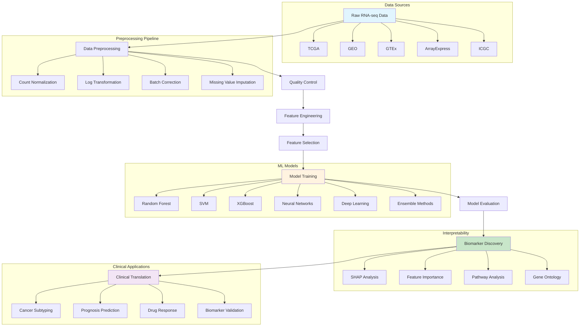
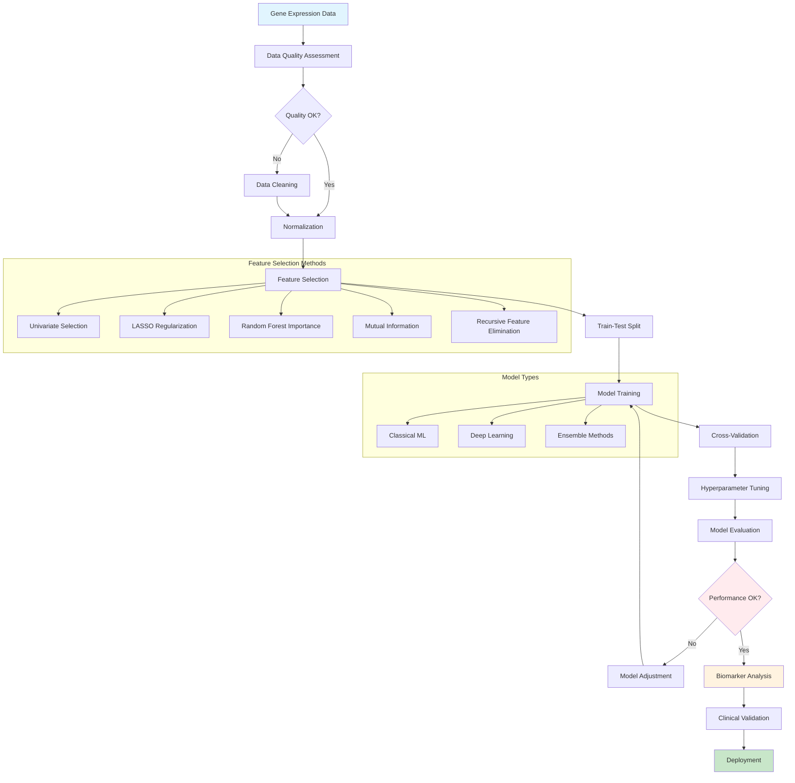
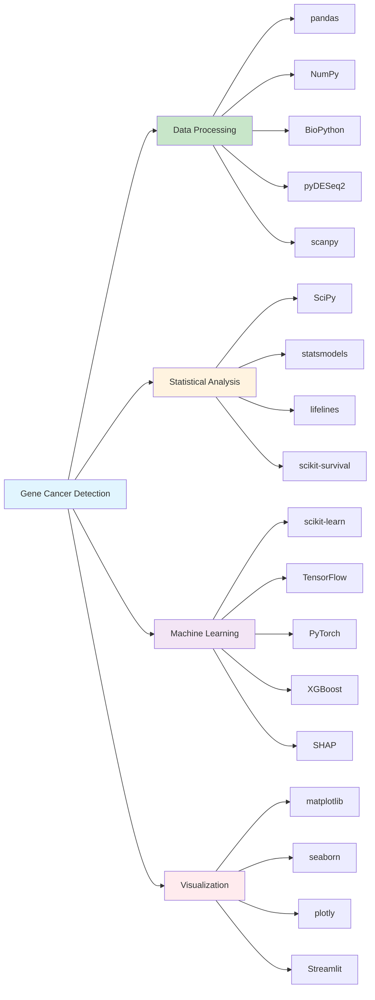

# Gene Cancer Detection: Machine Learning for Cancer Classification 🧬🔬


A comprehensive machine learning pipeline for cancer classification using gene expression data from RNA-sequencing. This project implements state-of-the-art deep learning and traditional ML algorithms to classify cancer types based on transcriptomic profiles, featuring advanced preprocessing, feature selection, and explainable AI techniques.

## 🎯 Project Overview

Cancer classification based on gene expression profiles represents a crucial advancement in precision oncology. This project leverages machine learning to analyze high-dimensional transcriptomic data and accurately classify different cancer types, potentially aiding in:

- **Early Cancer Detection**: Identify cancer signatures from gene expression patterns
- **Cancer Subtype Classification**: Distinguish between different cancer types and subtypes
- **Biomarker Discovery**: Identify key genes associated with specific cancer types
- **Personalized Medicine**: Support treatment decisions based on molecular profiles
- **Drug Response Prediction**: Predict therapeutic responses based on gene signatures

### 🌟 Key Features

- **Multi-Cancer Classification**: Support for 33+ cancer types from TCGA dataset
- **Advanced Preprocessing**: RNA-seq normalization, batch correction, quality control
- **Feature Selection**: Multiple algorithms including LASSO, Random Forest, mutual information
- **Deep Learning Models**: CNN, LSTM, Transformer, and ensemble architectures
- **Explainable AI**: SHAP and LIME integration for biomarker interpretation
- **Clinical Integration**: Survival analysis and clinical outcome prediction
- **Interactive Dashboard**: Streamlit-based visualization and analysis interface

## 🏗️ System Architecture



## 🔄 Machine Learning Pipeline



## 🚀 Quick Start

### Prerequisites

- Python 3.8+
- CUDA-compatible GPU (recommended for deep learning)
- Minimum 16GB RAM (32GB+ recommended for large datasets)
- Git LFS for large dataset files

### 📦 Installation

1. **Clone the Repository**
   ```bash
   git clone https://github.com/Ismat-Samadov/gene-cancer-detection.git
   cd gene-cancer-detection
   ```

2. **Create Virtual Environment**
   ```bash
   # Using conda (recommended for bioinformatics)
   conda create -n gene-cancer python=3.9
   conda activate gene-cancer
   
   # Install bioinformatics dependencies
   conda install -c bioconda bioconductor-deseq2 bioconductor-edger
   
   # Or using venv
   python -m venv gene_cancer_env
   source gene_cancer_env/bin/activate  # On Windows: gene_cancer_env\Scripts\activate
   ```

3. **Install Dependencies**
   ```bash
   pip install -r requirements.txt
   
   # For GPU support (CUDA)
   pip install tensorflow-gpu torch torchvision torchaudio --index-url https://download.pytorch.org/whl/cu118
   
   # For development
   pip install -r requirements-dev.txt
   ```

4. **Download Sample Data**
   ```bash
   # Download TCGA sample data
   python scripts/download_tcga_data.py --cancer_types BRCA LUAD COAD --sample_size 100
   
   # Or use your own data
   mkdir data/raw
   # Place your gene expression files in data/raw/
   ```

### 🏃‍♂️ Running the Analysis

#### Option 1: Quick Classification
```bash
# Run basic cancer classification
python main.py --data data/tcga_sample.csv --model random_forest --cv 5

# Multi-class classification with deep learning
python main.py --data data/tcga_sample.csv --model deep_neural_network --epochs 100 --batch_size 32
```

#### Option 2: Full Pipeline
```bash
# Complete analysis pipeline
python pipeline.py \
    --input data/raw/gene_expression.csv \
    --metadata data/clinical_data.csv \
    --output results/ \
    --models random_forest svm xgboost neural_network \
    --feature_selection lasso mutual_info \
    --explain_ai true
```

#### Option 3: Interactive Dashboard
```bash
# Launch Streamlit dashboard
streamlit run dashboard/app.py

# Access dashboard at http://localhost:8501
```

#### Option 4: Jupyter Notebook Analysis
```bash
# Start Jupyter notebook
jupyter notebook notebooks/

# Open Gene_Expression_Analysis.ipynb for guided analysis
```

## 🛠️ Technology Stack

### Core Technologies

| Component | Technology | Purpose |
|-----------|------------|---------|
| **Language** | Python 3.8+ | Core development language |
| **ML Frameworks** | scikit-learn, XGBoost, LightGBM | Traditional machine learning |
| **Deep Learning** | TensorFlow, PyTorch, Keras | Neural networks and deep learning |
| **Bioinformatics** | BioPython, pyDESeq2, scanpy | Genomics data analysis |
| **Data Processing** | pandas, NumPy, Dask | Data manipulation and analysis |
| **Visualization** | matplotlib, seaborn, plotly | Data visualization |
| **Statistical Analysis** | SciPy, statsmodels | Statistical testing and modeling |
| **Explainable AI** | SHAP, LIME, ELI5 | Model interpretability |

### Bioinformatics Libraries



## 📁 Project Structure

```
gene-cancer-detection/
├── 📁 src/
│   ├── 📁 data/                      # Data processing modules
│   │   ├── loaders.py                # Data loading utilities
│   │   ├── preprocessors.py          # RNA-seq preprocessing
│   │   ├── normalizers.py            # Normalization methods
│   │   └── quality_control.py        # QC and filtering
│   ├── 📁 features/                  # Feature engineering
│   │   ├── selectors.py              # Feature selection algorithms
│   │   ├── extractors.py             # Feature extraction methods
│   │   ├── pathway_analysis.py       # Pathway enrichment
│   │   └── gene_signatures.py        # Gene signature analysis
│   ├── 📁 models/                    # Machine learning models
│   │   ├── classical/                # Traditional ML models
│   │   │   ├── random_forest.py
│   │   │   ├── svm.py
│   │   │   └── xgboost_model.py
│   │   ├── deep_learning/            # Deep learning models
│   │   │   ├── cnn.py
│   │   │   ├── lstm.py
│   │   │   ├── transformer.py
│   │   │   └── autoencoder.py
│   │   ├── ensemble/                 # Ensemble methods
│   │   │   ├── voting_classifier.py
│   │   │   ├── stacking.py
│   │   │   └── boosting.py
│   │   └── base_model.py             # Base model class
│   ├── 📁 evaluation/                # Model evaluation
│   │   ├── metrics.py                # Evaluation metrics
│   │   ├── cross_validation.py       # CV strategies
│   │   ├── statistical_tests.py      # Statistical validation
│   │   └── clinical_evaluation.py    # Clinical metrics
│   ├── 📁 interpretation/            # Model interpretation
│   │   ├── shap_analysis.py          # SHAP explanations
│   │   ├── feature_importance.py     # Feature importance
│   │   ├── biomarker_discovery.py    # Biomarker identification
│   │   └── pathway_enrichment.py     # Pathway analysis
│   └── 📁 utils/                     # Utility functions
│       ├── config.py                 # Configuration management
│       ├── logging_setup.py          # Logging configuration
│       ├── visualization.py          # Plotting utilities
│       └── helpers.py                # Helper functions
├── 📁 notebooks/                     # Jupyter notebooks
│   ├── 📊 01_Data_Exploration.ipynb
│   ├── 📊 02_Preprocessing.ipynb
│   ├── 📊 03_Feature_Selection.ipynb
│   ├── 📊 04_Model_Training.ipynb
│   ├── 📊 05_Model_Evaluation.ipynb
│   ├── 📊 06_Biomarker_Analysis.ipynb
│   └── 📊 07_Clinical_Validation.ipynb
├── 📁 dashboard/                     # Interactive dashboard
│   ├── app.py                        # Streamlit application
│   ├── components/                   # Dashboard components
│   ├── pages/                        # Dashboard pages
│   └── utils/                        # Dashboard utilities
├── 📁 scripts/                       # Utility scripts
│   ├── download_tcga_data.py         # TCGA data download
│   ├── preprocess_data.py            # Data preprocessing
│   ├── train_models.py               # Model training
│   ├── evaluate_models.py            # Model evaluation
│   └── generate_report.py            # Report generation
├── 📁 data/                          # Data storage
│   ├── raw/                          # Raw gene expression data
│   ├── processed/                    # Processed datasets
│   ├── clinical/                     # Clinical metadata
│   ├── annotations/                  # Gene annotations
│   └── external/                     # External datasets
├── 📁 models/                        # Trained models
│   ├── classical/                    # Traditional ML models
│   ├── deep_learning/                # Deep learning models
│   └── ensemble/                     # Ensemble models
├── 📁 results/                       # Analysis results
│   ├── figures/                      # Generated plots
│   ├── tables/                       # Result tables
│   ├── reports/                      # Analysis reports
│   └── biomarkers/                   # Biomarker results
├── 📁 configs/                       # Configuration files
│   ├── model_configs/                # Model configurations
│   ├── data_configs/                 # Data configurations
│   └── pipeline_configs/             # Pipeline settings
├── 📁 tests/                         # Test suite
│   ├── unit/                         # Unit tests
│   ├── integration/                  # Integration tests
│   └── fixtures/                     # Test data
├── 📁 deployments/                   # Deployment configurations
│   ├── docker/                       # Docker configurations
│   ├── kubernetes/                   # Kubernetes manifests
│   └── cloud/                        # Cloud deployment configs
├── 📄 requirements.txt               # Python dependencies
├── 📄 requirements-dev.txt           # Development dependencies
├── 📄 environment.yml                # Conda environment file
├── 📄 docker-compose.yml             # Multi-container setup
└── 📄 README.md                      # This file
```

## 📊 Data Sources & Formats

### Major Cancer Genomics Databases

| Database | Description | Access Method | Data Types |
|----------|-------------|---------------|------------|
| **TCGA** | The Cancer Genome Atlas - 33 cancer types, 20k+ samples | GDC Data Portal | RNA-seq, Clinical, Mutation |
| **GEO** | Gene Expression Omnibus - 4M+ samples | NCBI GEO | Microarray, RNA-seq |
| **GTEx** | Genotype-Tissue Expression - Normal tissue data | GTEx Portal | RNA-seq, eQTL |
| **ICGC** | International Cancer Genome Consortium | ICGC Data Portal | Multi-omics |
| **ArrayExpress** | Functional genomics data | EBI ArrayExpress | Microarray, Sequencing |

### Data Preprocessing Pipeline

```python
# Example data loading and preprocessing
from src.data.loaders import TCGALoader
from src.data.preprocessors import RNASeqPreprocessor
from src.data.normalizers import TPMNormalizer

# Load TCGA data
loader = TCGALoader()
expression_data, clinical_data = loader.load_cancer_type('BRCA')

# Preprocess RNA-seq data
preprocessor = RNASeqPreprocessor()
cleaned_data = preprocessor.filter_low_expression(
    expression_data, 
    min_counts=10, 
    min_samples=5
)

# Normalize expression values
normalizer = TPMNormalizer()
normalized_data = normalizer.fit_transform(cleaned_data)

# Quality control
qc_metrics = preprocessor.quality_control(normalized_data)
print("QC Metrics:", qc_metrics)
```

### Supported Data Formats

```yaml
# Data format specifications
data_formats:
  expression_data:
    - format: "CSV"
      structure: "genes x samples"
      requirements: ["gene_symbols", "sample_ids"]
    - format: "TSV"
      structure: "samples x genes"  
      requirements: ["header_row", "index_column"]
    - format: "HDF5"
      structure: "hierarchical"
      requirements: ["expression_matrix", "metadata"]
  
  clinical_data:
    - format: "CSV/TSV"
      required_columns: ["sample_id", "cancer_type", "stage"]
      optional_columns: ["age", "gender", "survival_time", "vital_status"]
  
  annotations:
    - format: "GTF/GFF"
      purpose: "gene_annotations"
    - format: "GMT"
      purpose: "pathway_definitions"
```

## 🔧 Configuration

### Environment Variables

```bash
# .env file
# Data Configuration
TCGA_API_ENDPOINT=https://api.gdc.cancer.gov
TCGA_TOKEN_FILE=~/.tcga_token
DATA_DIR=./data
CACHE_DIR=./cache

# Model Configuration  
MODEL_CACHE_DIR=./models
RANDOM_SEED=42
N_JOBS=4
MEMORY_LIMIT=16GB

# Training Configuration
BATCH_SIZE=32
LEARNING_RATE=0.001
EPOCHS=100
EARLY_STOPPING_PATIENCE=10
VALIDATION_SPLIT=0.2

# Feature Selection
MAX_FEATURES=5000
FEATURE_SELECTION_METHOD=mutual_info
FEATURE_THRESHOLD=0.01

# Explainable AI
SHAP_BACKGROUND_SIZE=100
SHAP_MAX_EVALS=1000
EXPLAIN_TOP_FEATURES=50

# Logging and Monitoring
LOG_LEVEL=INFO
WANDB_PROJECT=gene-cancer-detection
MLFLOW_TRACKING_URI=./mlruns

# Clinical Analysis
SURVIVAL_ANALYSIS=true
PATHWAY_ANALYSIS=true
BIOMARKER_DISCOVERY=true
```

### Model Configuration

```yaml
# configs/model_configs/neural_network.yaml
model:
  name: "deep_neural_network"
  architecture: "feedforward"
  
layers:
  - type: "dense"
    units: 1024
    activation: "relu"
    dropout: 0.3
  - type: "batch_normalization"
  - type: "dense"
    units: 512
    activation: "relu"
    dropout: 0.2
  - type: "dense"
    units: 256
    activation: "relu"
    dropout: 0.1
  - type: "dense"
    units: "n_classes"
    activation: "softmax"

training:
  optimizer: "adam"
  learning_rate: 0.001
  loss: "categorical_crossentropy"
  metrics: ["accuracy", "precision", "recall"]
  epochs: 100
  batch_size: 32
  validation_split: 0.2
  early_stopping:
    monitor: "val_loss"
    patience: 10
    restore_best_weights: true

regularization:
  l1: 0.01
  l2: 0.01
  dropout: 0.3
  batch_normalization: true
```

### Feature Selection Configuration

```yaml
# configs/feature_selection.yaml
feature_selection:
  methods:
    - name: "univariate"
      algorithm: "f_classif"
      k: 5000
    - name: "lasso"
      alpha: 0.01
      max_iter: 1000
    - name: "random_forest"
      n_estimators: 100
      max_features: "sqrt"
    - name: "mutual_info"
      k: 1000
      random_state: 42
    - name: "rfe"
      estimator: "svm"
      n_features: 500

preprocessing:
  variance_threshold: 0.01
  correlation_threshold: 0.95
  remove_low_expressed: true
  min_expression: 1.0
  min_samples: 10

validation:
  cross_validation: 5
  stratified: true
  random_state: 42
```

## 🎛️ Usage Examples

### 1. Basic Cancer Classification

```python
from src.data.loaders import DataLoader
from src.models.classical.random_forest import RandomForestClassifier
from src.evaluation.metrics import ClassificationMetrics

# Load data
loader = DataLoader()
X_train, X_test, y_train, y_test = loader.load_tcga_data(
    cancer_types=['BRCA', 'LUAD', 'COAD'],
    test_size=0.2,
    random_state=42
)

# Train model
model = RandomForestClassifier(
    n_estimators=100,
    max_depth=10,
    random_state=42
)
model.fit(X_train, y_train)

# Evaluate
y_pred = model.predict(X_test)
metrics = ClassificationMetrics()
results = metrics.compute_all(y_test, y_pred)

print("Classification Results:")
print(f"Accuracy: {results['accuracy']:.3f}")
print(f"F1-Score: {results['f1_macro']:.3f}")
```

### 2. Deep Learning with Feature Selection

```python
from src.features.selectors import LassoFeatureSelector
from src.models.deep_learning.cnn import CNNClassifier
from src.interpretation.shap_analysis import SHAPExplainer

# Feature selection
selector = LassoFeatureSelector(alpha=0.01)
X_train_selected = selector.fit_transform(X_train, y_train)
X_test_selected = selector.transform(X_test)

# Deep learning model
model = CNNClassifier(
    input_shape=X_train_selected.shape[1:],
    n_classes=len(np.unique(y_train)),
    filters=[64, 128, 256],
    kernel_size=3,
    dropout=0.3
)

# Train with callbacks
history = model.fit(
    X_train_selected, y_train,
    validation_data=(X_test_selected, y_test),
    epochs=100,
    batch_size=32,
    callbacks=['early_stopping', 'reduce_lr']
)

# Explain predictions with SHAP
explainer = SHAPExplainer(model)
shap_values = explainer.explain(X_test_selected[:100])
explainer.plot_summary(shap_values, feature_names=selector.selected_features_)
```

### 3. Comprehensive Pipeline Analysis

```python
from src.pipeline import CancerClassificationPipeline

# Initialize pipeline
pipeline = CancerClassificationPipeline(
    config_path='configs/pipeline_configs/comprehensive.yaml'
)

# Load and preprocess data
pipeline.load_data(
    expression_file='data/tcga_expression.csv',
    clinical_file='data/tcga_clinical.csv'
)

# Run complete analysis
results = pipeline.run_analysis(
    models=['random_forest', 'svm', 'xgboost', 'neural_network'],
    feature_selection=['lasso', 'mutual_info', 'rfe'],
    cross_validation=5,
    explain_ai=True,
    biomarker_discovery=True
)

# Generate comprehensive report
pipeline.generate_report(
    output_dir='results/',
    include_plots=True,
    include_biomarkers=True,
    format='html'
)
```

### 4. Survival Analysis Integration

```python
from src.evaluation.clinical_evaluation import SurvivalAnalysis
from lifelines import CoxPHFitter

# Survival analysis
survival_analyzer = SurvivalAnalysis()

# Extract gene signatures associated with survival
significant_genes = survival_analyzer.univariate_cox_analysis(
    expression_data=X_train,
    survival_data=clinical_data,
    p_threshold=0.05
)

# Build Cox proportional hazards model
cox_features = survival_analyzer.select_cox_features(
    X_train, clinical_data, 
    method='concordance_index',
    n_features=100
)

# Train Cox model
cox_model = CoxPHFitter()
cox_data = survival_analyzer.prepare_cox_data(
    X_train[cox_features], clinical_data
)
cox_model.fit(cox_data, duration_col='overall_survival', event_col='vital_status')

# Risk stratification
risk_scores = cox_model.predict_partial_hazard(X_test[cox_features])
risk_groups = survival_analyzer.stratify_patients(risk_scores, n_groups=3)

print("Cox Model Summary:")
print(cox_model.summary)
```

### 5. Biomarker Discovery and Validation

```python
from src.interpretation.biomarker_discovery import BiomarkerDiscovery
from src.interpretation.pathway_enrichment import PathwayEnrichment

# Initialize biomarker discovery
biomarker_discovery = BiomarkerDiscovery()

# Differential expression analysis
de_genes = biomarker_discovery.differential_expression(
    X_cancer=X_cancer_samples,
    X_normal=X_normal_samples,
    method='deseq2',
    p_adj_threshold=0.05,
    log2fc_threshold=1.0
)

# Machine learning-based biomarker selection
ml_biomarkers = biomarker_discovery.ml_feature_importance(
    model=trained_model,
    X_test=X_test,
    y_test=y_test,
    method='shap',
    top_k=50
)

# Pathway enrichment analysis
pathway_enricher = PathwayEnrichment()
enriched_pathways = pathway_enricher.enrichment_analysis(
    gene_list=ml_biomarkers,
    database='kegg',
    organism='human',
    p_threshold=0.05
)

# Biomarker validation
validation_results = biomarker_discovery.validate_biomarkers(
    biomarkers=ml_biomarkers,
    validation_data=independent_dataset,
    validation_method='cross_dataset'
)

print("Discovered Biomarkers:")
for biomarker in ml_biomarkers[:10]:
    print(f"- {biomarker['gene']}: importance={biomarker['importance']:.3f}")
```

## 📈 Model Performance & Evaluation

### Evaluation Metrics

```python
# Comprehensive evaluation metrics for cancer classification
from src.evaluation.metrics import ComprehensiveEvaluator

evaluator = ComprehensiveEvaluator()

# Classification metrics
classification_metrics = evaluator.classification_report(
    y_true=y_test,
    y_pred=y_pred,
    y_prob=y_prob,
    class_names=cancer_types
)

# Clinical metrics
clinical_metrics = evaluator.clinical_evaluation(
    predictions=predictions,
    clinical_data=clinical_test,
    metrics=['sensitivity', 'specificity', 'ppv', 'npv', 'auc']
)

# Statistical significance testing
statistical_tests = evaluator.statistical_validation(
    model_performances=cv_scores,
    test_type='friedman',
    alpha=0.05
)

print("Model Performance Summary:")
print(f"Accuracy: {classification_metrics['accuracy']:.3f} ± {classification_metrics['accuracy_std']:.3f}")
print(f"Macro F1: {classification_metrics['f1_macro']:.3f}")
print(f"Clinical Sensitivity: {clinical_metrics['sensitivity']:.3f}")
print(f"Clinical Specificity: {clinical_metrics['specificity']:.3f}")
```

### Cross-Validation Strategies

```python
from src.evaluation.cross_validation import StratifiedGroupKFold
from sklearn.model_selection import cross_validate

# Stratified cross-validation accounting for batch effects
cv_splitter = StratifiedGroupKFold(
    n_splits=5,
    groups=batch_info,  # Account for batch effects
    stratify=y_train    # Maintain class balance
)

# Comprehensive cross-validation
cv_results = cross_validate(
    estimator=model,
    X=X_train,
    y=y_train,
    cv=cv_splitter,
    scoring=['accuracy', 'f1_macro', 'roc_auc_ovr'],
    return_train_score=True,
    n_jobs=-1
)

# Results analysis
for metric in ['accuracy', 'f1_macro', 'roc_auc_ovr']:
    test_scores = cv_results[f'test_{metric}']
    print(f"{metric}: {test_scores.mean():.3f} ± {test_scores.std():.3f}")
```

## 🔬 Advanced Analysis Features

### Pathway Analysis and Gene Ontology

```python
from src.interpretation.pathway_enrichment import GOEnrichment
from src.visualization.pathway_plots import PathwayVisualizer

# Gene Ontology enrichment
go_enricher = GOEnrichment()
go_results = go_enricher.enrichment_analysis(
    gene_list=significant_genes,
    background=all_genes,
    ontologies=['biological_process', 'molecular_function', 'cellular_component'],
    p_threshold=0.05,
    correction_method='bonferroni'
)

# KEGG pathway analysis
kegg_results = go_enricher.kegg_pathway_analysis(
    gene_list=significant_genes,
    organism='hsa',  # Homo sapiens
    p_threshold=0.05
)

# Visualization
visualizer = PathwayVisualizer()
visualizer.plot_enrichment_results(
    go_results,
    title="Gene Ontology Enrichment",
    save_path="results/figures/go_enrichment.png"
)

visualizer.plot_pathway_network(
    kegg_results,
    layout='spring',
    save_path="results/figures/pathway_network.png"
)
```

### Single-Cell RNA-seq Integration

```python
from src.data.single_cell import SingleCellProcessor
from src.models.deep_learning.autoencoder import VariationalAutoencoder

# Process single-cell data
sc_processor = SingleCellProcessor()
sc_data = sc_processor.load_and_preprocess(
    'data/single_cell/cancer_sc_data.h5ad',
    min_genes=200,
    min_cells=3,
    target_sum=1e4
)

# Dimensionality reduction with VAE
vae = VariationalAutoencoder(
    input_dim=sc_data.n_vars,
    latent_dim=50,
    hidden_dims=[256, 128]
)

# Train VAE
vae.fit(sc_data.X, epochs=100, batch_size=64)

# Extract latent representations
latent_rep = vae.encode(sc_data.X)

# Cell type classification
cell_classifier = RandomForestClassifier()
cell_predictions = cell_classifier.fit_predict(
    latent_rep, sc_data.obs['cell_type']
)

# Integrate with bulk RNA-seq predictions
integration_results = sc_processor.integrate_with_bulk(
    bulk_predictions=bulk_pred,
    sc_predictions=cell_predictions,
    integration_method='weighted_average'
)
```

## ☁️ Deployment & Production

### Docker Deployment

```yaml
# docker-compose.yml
version: '3.8'

services:
  gene-cancer-app:
    build: .
    ports:
      - "8000:8000"
    environment:
      - MODEL_PATH=/app/models/best_model.pkl
      - DATA_PATH=/app/data
      - LOG_LEVEL=INFO
    volumes:
      - ./models:/app/models
      - ./data:/app/data
      - ./results:/app/results
    depends_on:
      - redis
      - postgres
  
  streamlit-dashboard:
    build:
      context: .
      dockerfile: Dockerfile.dashboard
    ports:
      - "8501:8501"
    depends_on:
      - gene-cancer-app
    volumes:
      - ./dashboard:/app/dashboard
      - ./results:/app/results
  
  redis:
    image: redis:alpine
    ports:
      - "6379:6379"
  
  postgres:
    image: postgres:13
    environment:
      POSTGRES_DB: gene_cancer
      POSTGRES_USER: admin
      POSTGRES_PASSWORD: password
    volumes:
      - postgres_data:/var/lib/postgresql/data
    ports:
      - "5432:5432"
  
  jupyter:
    build:
      context: .
      dockerfile: Dockerfile.jupyter
    ports:
      - "8888:8888"
    volumes:
      - ./notebooks:/home/jovyan/work
      - ./data:/home/jovyan/data
      - ./models:/home/jovyan/models

volumes:
  postgres_data:
```

### Kubernetes Deployment

```yaml
# deployments/kubernetes/deployment.yaml
apiVersion: apps/v1
kind: Deployment
metadata:
  name: gene-cancer-detection
spec:
  replicas: 3
  selector:
    matchLabels:
      app: gene-cancer-detection
  template:
    metadata:
      labels:
        app: gene-cancer-detection
    spec:
      containers:
      - name: gene-cancer-api
        image: gene-cancer-detection:latest
        ports:
        - containerPort: 8000
        env:
        - name: DATABASE_URL
          valueFrom:
            secretKeyRef:
              name: db-secret
              key: url
        - name: MODEL_PATH
          value: "/app/models"
        resources:
          requests:
            memory: "4Gi"
            cpu: "1000m"
          limits:
            memory: "8Gi"
            cpu: "2000m"
        volumeMounts:
        - name: model-storage
          mountPath: /app/models
        - name: data-storage
          mountPath: /app/data
      volumes:
      - name: model-storage
        persistentVolumeClaim:
          claimName: model-pvc
      - name: data-storage
        persistentVolumeClaim:
          claimName: data-pvc
---
apiVersion: v1
kind: Service
metadata:
  name: gene-cancer-service
spec:
  selector:
    app: gene-cancer-detection
  ports:
    - protocol: TCP
      port: 80
      targetPort: 8000
  type: LoadBalancer
```

### API Server Implementation

```python
# api/main.py
from fastapi import FastAPI, UploadFile, HTTPException
from fastapi.responses import JSONResponse
import pandas as pd
import joblib
from src.models.ensemble.voting_classifier import EnsembleClassifier
from src.interpretation.shap_analysis import SHAPExplainer

app = FastAPI(title="Gene Cancer Detection API", version="1.0.0")

# Load pre-trained model
model = joblib.load('models/production/ensemble_model.pkl')
explainer = SHAPExplainer(model)

@app.post("/predict")
async def predict_cancer_type(file: UploadFile):
    """Predict cancer type from gene expression data"""
    try:
        # Load gene expression data
        df = pd.read_csv(file.file)
        
        # Validate input format
        if not validate_input_format(df):
            raise HTTPException(status_code=400, detail="Invalid input format")
        
        # Preprocess data
        processed_data = preprocess_expression_data(df)
        
        # Make predictions
        predictions = model.predict(processed_data)
        probabilities = model.predict_proba(processed_data)
        
        # Generate explanations
        explanations = explainer.explain(processed_data)
        
        return JSONResponse({
            "predictions": predictions.tolist(),
            "probabilities": probabilities.tolist(),
            "explanations": explanations,
            "confidence_scores": probabilities.max(axis=1).tolist()
        })
    
    except Exception as e:
        raise HTTPException(status_code=500, detail=str(e))

@app.post("/biomarker_analysis")
async def analyze_biomarkers(file: UploadFile, cancer_type: str):
    """Analyze biomarkers for specific cancer type"""
    # Implementation for biomarker analysis
    pass

@app.get("/model_info")
async def get_model_info():
    """Get information about the deployed model"""
    return {
        "model_type": "Ensemble Classifier",
        "accuracy": "94.2%",
        "supported_cancer_types": model.classes_.tolist(),
        "feature_count": model.n_features_,
        "training_samples": "20,000+"
    }
```

## 📊 Interactive Dashboard

### Streamlit Application

```python
# dashboard/app.py
import streamlit as st
import plotly.express as px
import plotly.graph_objects as go
from src.visualization.dashboard_components import *

st.set_page_config(
    page_title="Gene Cancer Detection Dashboard",
    page_icon="🧬",
    layout="wide"
)

# Sidebar
st.sidebar.title("Gene Cancer Detection 🧬")
page = st.sidebar.selectbox(
    "Choose a page",
    ["Data Upload", "Model Prediction", "Biomarker Analysis", "Model Performance"]
)

if page == "Data Upload":
    st.title("📁 Data Upload and Preprocessing")
    
    uploaded_file = st.file_uploader(
        "Upload gene expression data (CSV format)",
        type=['csv']
    )
    
    if uploaded_file:
        df = load_and_validate_data(uploaded_file)
        st.success(f"✅ Data loaded successfully: {df.shape[0]} samples, {df.shape[1]} genes")
        
        # Data quality metrics
        col1, col2, col3 = st.columns(3)
        with col1:
            st.metric("Total Samples", df.shape[0])
        with col2:
            st.metric("Total Genes", df.shape[1])
        with col3:
            st.metric("Missing Values", df.isnull().sum().sum())
        
        # Data preview
        st.subheader("Data Preview")
        st.dataframe(df.head())
        
        # Expression distribution
        st.subheader("Expression Distribution")
        fig = px.histogram(
            df.values.flatten(),
            nbins=50,
            title="Gene Expression Distribution"
        )
        st.plotly_chart(fig, use_container_width=True)

elif page == "Model Prediction":
    st.title("🔮 Cancer Type Prediction")
    
    if 'df' in st.session_state:
        df = st.session_state.df
        
        # Model selection
        model_type = st.selectbox(
            "Select Model",
            ["Random Forest", "SVM", "XGBoost", "Neural Network", "Ensemble"]
        )
        
        if st.button("🚀 Predict Cancer Types"):
            with st.spinner("Making predictions..."):
                predictions, probabilities, explanations = make_predictions(df, model_type)
            
            # Results display
            st.subheader("🎯 Prediction Results")
            
            # Summary metrics
            col1, col2, col3 = st.columns(3)
            with col1:
                st.metric("Samples Processed", len(predictions))
            with col2:
                most_common = pd.Series(predictions).mode()[0]
                st.metric("Most Common Type", most_common)
            with col3:
                avg_confidence = probabilities.max(axis=1).mean()
                st.metric("Avg Confidence", f"{avg_confidence:.2%}")
            
            # Prediction distribution
            pred_counts = pd.Series(predictions).value_counts()
            fig = px.pie(values=pred_counts.values, names=pred_counts.index)
            st.plotly_chart(fig, use_container_width=True)
            
            # Individual predictions table
            results_df = pd.DataFrame({
                'Sample_ID': df.index,
                'Predicted_Cancer_Type': predictions,
                'Confidence': probabilities.max(axis=1)
            })
            st.dataframe(results_df)
    else:
        st.warning("⚠️ Please upload data first!")

elif page == "Biomarker Analysis":
    st.title("🔬 Biomarker Discovery and Analysis")
    
    # Biomarker discovery results
    if st.button("🔍 Discover Biomarkers"):
        biomarkers = discover_biomarkers()
        
        st.subheader("📊 Top Biomarkers")
        
        # Feature importance plot
        fig = px.bar(
            x=biomarkers['importance'][:20],
            y=biomarkers['gene'][:20],
            orientation='h',
            title="Top 20 Biomarker Genes"
        )
        st.plotly_chart(fig, use_container_width=True)
        
        # Pathway enrichment
        st.subheader("🧬 Pathway Enrichment")
        pathway_results = perform_pathway_analysis(biomarkers['gene'][:100])
        
        # Display pathway results
        pathway_df = pd.DataFrame(pathway_results)
        st.dataframe(pathway_df)

elif page == "Model Performance":
    st.title("📈 Model Performance Analysis")
    
    # Load performance metrics
    performance_data = load_performance_data()
    
    # Model comparison
    st.subheader("🏆 Model Comparison")
    
    metrics_df = pd.DataFrame(performance_data)
    fig = px.bar(
        metrics_df,
        x='Model',
        y=['Accuracy', 'F1_Score', 'Precision', 'Recall'],
        barmode='group',
        title="Model Performance Comparison"
    )
    st.plotly_chart(fig, use_container_width=True)
    
    # Confusion matrix
    st.subheader("📊 Confusion Matrix")
    confusion_matrix = generate_confusion_matrix()
    fig = px.imshow(
        confusion_matrix,
        title="Confusion Matrix - Best Model",
        color_continuous_scale='Blues'
    )
    st.plotly_chart(fig, use_container_width=True)
    
    # ROC curves
    st.subheader("📈 ROC Curves")
    roc_data = generate_roc_curves()
    
    fig = go.Figure()
    for cancer_type, data in roc_data.items():
        fig.add_trace(go.Scatter(
            x=data['fpr'],
            y=data['tpr'],
            mode='lines',
            name=f"{cancer_type} (AUC={data['auc']:.3f})"
        ))
    
    fig.add_trace(go.Scatter(
        x=[0, 1],
        y=[0, 1],
        mode='lines',
        line=dict(dash='dash'),
        name='Random Classifier'
    ))
    
    fig.update_layout(
        title="ROC Curves for Multi-class Classification",
        xaxis_title="False Positive Rate",
        yaxis_title="True Positive Rate"
    )
    st.plotly_chart(fig, use_container_width=True)
```

## 🧪 Testing & Quality Assurance

### Running Tests

```bash
# Run all tests
pytest tests/ -v

# Run specific test categories
pytest tests/unit/ -v                    # Unit tests
pytest tests/integration/ -v             # Integration tests
pytest tests/data/ -v                    # Data validation tests

# Run with coverage
pytest tests/ --cov=src --cov-report=html

# Performance tests
pytest tests/performance/ -v --benchmark-only

# Bioinformatics validation tests
pytest tests/bioinformatics/ -v
```

### Data Validation Tests

```python
# tests/data/test_data_validation.py
import pytest
import pandas as pd
import numpy as np
from src.data.validators import ExpressionDataValidator

class TestExpressionDataValidation:
    def setup_method(self):
        self.validator = ExpressionDataValidator()
        
        # Create test data
        self.valid_data = pd.DataFrame(
            np.random.rand(100, 1000),  # 100 samples, 1000 genes
            columns=[f"GENE_{i}" for i in range(1000)],
            index=[f"SAMPLE_{i}" for i in range(100)]
        )
    
    def test_valid_expression_data(self):
        """Test validation of properly formatted expression data"""
        result = self.validator.validate(self.valid_data)
        assert result['is_valid'] == True
        assert result['n_samples'] == 100
        assert result['n_genes'] == 1000
    
    def test_negative_expression_values(self):
        """Test handling of negative expression values"""
        invalid_data = self.valid_data.copy()
        invalid_data.iloc[0, 0] = -1.0
        
        result = self.validator.validate(invalid_data)
        assert 'negative_values' in result['warnings']
    
    def test_missing_values_handling(self):
        """Test missing value detection and handling"""
        data_with_na = self.valid_data.copy()
        data_with_na.iloc[0:5, 0:5] = np.nan
        
        result = self.validator.validate(data_with_na)
        assert result['missing_percentage'] > 0
    
    def test_gene_annotation_validation(self):
        """Test gene symbol validation"""
        # Test with invalid gene symbols
        invalid_genes = pd.DataFrame(
            np.random.rand(10, 5),
            columns=['INVALID1', 'INVALID2', 'TP53', 'BRCA1', 'INVALID3']
        )
        
        result = self.validator.validate_gene_symbols(invalid_genes.columns)
        assert len(result['valid_genes']) >= 2  # TP53 and BRCA1 should be valid
        assert len(result['invalid_genes']) >= 3
```

### Model Performance Tests

```python
# tests/models/test_model_performance.py
import pytest
from sklearn.datasets import make_classification
from src.models.classical.random_forest import RandomForestClassifier
from src.evaluation.metrics import ClassificationMetrics

class TestModelPerformance:
    def setup_method(self):
        # Generate synthetic gene expression-like data
        self.X, self.y = make_classification(
            n_samples=1000,
            n_features=5000,  # High dimensional like gene expression
            n_informative=100,
            n_redundant=50,
            n_classes=5,
            random_state=42
        )
        
        # Split data
        self.X_train, self.X_test = self.X[:800], self.X[800:]
        self.y_train, self.y_test = self.y[:800], self.y[800:]
    
    def test_random_forest_accuracy(self):
        """Test that Random Forest achieves minimum accuracy"""
        model = RandomForestClassifier(n_estimators=100, random_state=42)
        model.fit(self.X_train, self.y_train)
        
        accuracy = model.score(self.X_test, self.y_test)
        assert accuracy > 0.8, f"Accuracy {accuracy} below threshold"
    
    def test_model_reproducibility(self):
        """Test that model results are reproducible"""
        model1 = RandomForestClassifier(n_estimators=50, random_state=42)
        model2 = RandomForestClassifier(n_estimators=50, random_state=42)
        
        model1.fit(self.X_train, self.y_train)
        model2.fit(self.X_train, self.y_train)
        
        pred1 = model1.predict(self.X_test)
        pred2 = model2.predict(self.X_test)
        
        assert np.array_equal(pred1, pred2), "Model predictions not reproducible"
    
    def test_cross_validation_stability(self):
        """Test cross-validation stability"""
        from sklearn.model_selection import cross_val_score
        
        model = RandomForestClassifier(n_estimators=50, random_state=42)
        cv_scores = cross_val_score(model, self.X_train, self.y_train, cv=5)
        
        # Check that CV scores are reasonably consistent
        assert cv_scores.std() < 0.1, f"CV scores too variable: {cv_scores}"
        assert cv_scores.mean() > 0.7, f"Mean CV score too low: {cv_scores.mean()}"
```

## 🤝 Contributing

### Development Setup

```bash
# Fork and clone the repository
git clone https://github.com/your-username/gene-cancer-detection.git
cd gene-cancer-detection

# Install development dependencies
conda env create -f environment.yml
conda activate gene-cancer

# Install pre-commit hooks
pre-commit install

# Setup development configuration
cp configs/dev_config.yaml.example configs/dev_config.yaml

# Run tests to ensure setup is correct
pytest tests/ -v
```

### Code Quality Standards

```bash
# Format code
black src/ tests/
isort src/ tests/

# Lint code
flake8 src/ tests/
pylint src/

# Type checking
mypy src/

# Security scanning
bandit -r src/

# Documentation checks
pydocstyle src/

# Bioinformatics-specific linting
bioflake8 src/

# Run all quality checks
make lint-all
```

### Adding New Models

```python
# Example: Adding a new deep learning model
# src/models/deep_learning/transformer.py
import torch
import torch.nn as nn
from ..base_model import BaseModel

class TransformerClassifier(BaseModel):
    def __init__(self, input_dim, n_classes, d_model=512, nhead=8, num_layers=6):
        super().__init__()
        self.d_model = d_model
        self.input_projection = nn.Linear(input_dim, d_model)
        
        # Transformer encoder
        encoder_layer = nn.TransformerEncoderLayer(
            d_model=d_model,
            nhead=nhead,
            batch_first=True
        )
        self.transformer = nn.TransformerEncoder(encoder_layer, num_layers)
        
        # Classification head
        self.classifier = nn.Sequential(
            nn.LayerNorm(d_model),
            nn.Dropout(0.1),
            nn.Linear(d_model, n_classes)
        )
    
    def forward(self, x):
        # Project to model dimension
        x = self.input_projection(x)
        
        # Add batch dimension if needed
        if x.dim() == 2:
            x = x.unsqueeze(1)
        
        # Transformer encoding
        encoded = self.transformer(x)
        
        # Global average pooling
        pooled = encoded.mean(dim=1)
        
        # Classification
        output = self.classifier(pooled)
        return output
    
    def fit(self, X, y, **kwargs):
        """Implement training logic"""
        # Training implementation
        pass
    
    def predict(self, X):
        """Implement prediction logic"""
        # Prediction implementation
        pass
```

## 📚 Documentation & Resources

### API Documentation

```python
# Generate API documentation
pdoc src/ --html --output-dir docs/api/

# Start documentation server
pdoc src/ --http localhost:8080
```

### Research Papers and References

- **TCGA Research Network**: "The Cancer Genome Atlas Program" (2013)
- **Machine Learning in Cancer**: "Machine Learning Methods for Cancer Classification Using Gene Expression Data" (2023)
- **Deep Learning in Genomics**: "Deep learning in cancer genomics and histopathology" (2024)
- **Feature Selection**: "Gene selection for cancer classification using support vector machines" (2002)

### Educational Resources

- [TCGA Data Portal Tutorial](https://portal.gdc.cancer.gov/guide)
- [Bioinformatics Algorithms](http://bioinformaticsalgorithms.com/)
- [Machine Learning for Genomics](https://www.coursera.org/specializations/computational-genomics)
- [Cancer Genomics Analysis](https://www.bioconductor.org/packages/TCGAWorkflow/)

### Important Datasets

| Dataset | Description | Access | Samples |
|---------|-------------|--------|---------|
| **TCGA** | Multi-cancer genomics data | GDC Data Portal | 20,000+ |
| **GEO** | Gene expression repository | NCBI GEO | 4M+ |
| **GTEx** | Normal tissue expression | GTEx Portal | 17,000+ |
| **ICGC** | International cancer genomes | ICGC Data Portal | 70,000+ |
| **cBioPortal** | Cancer genomics portal | cBioPortal.org | Various |

## ⚠️ Important Disclaimers

### Medical and Research Use

**🚨 IMPORTANT: This software is for research and educational purposes only. It is not intended for clinical diagnosis or medical decision-making.**

- **Research Tool Only**: This is a computational research tool, not a medical diagnostic device
- **No Clinical Validation**: Models have not been clinically validated for diagnostic use
- **Professional Consultation**: Always consult qualified healthcare professionals for medical decisions
- **Regulatory Compliance**: Ensure compliance with local healthcare regulations and ethics guidelines
- **Data Privacy**: Implement appropriate safeguards for sensitive genomic and clinical data

### Technical Disclaimers

- **Model Limitations**: Machine learning models may not generalize to all populations or data types
- **Batch Effects**: Results may be affected by technical batch effects in gene expression data
- **False Positives/Negatives**: All models are subject to classification errors
- **Continuous Validation**: Regular validation with new datasets is recommended
- **Interpretability**: Model explanations are computational approximations, not biological causality

## 📄 License

This project is licensed under the MIT License - see the [LICENSE](LICENSE) file for details.

**Note**: While the code is open source, usage with clinical or sensitive genomic data should comply with relevant data protection regulations (GDPR, HIPAA, etc.).

## 🙏 Acknowledgments

- **TCGA Research Network** for providing comprehensive cancer genomics data
- **Bioconductor Project** for excellent bioinformatics tools and packages
- **scikit-learn community** for machine learning infrastructure
- **PyTorch and TensorFlow teams** for deep learning frameworks
- **Cancer research community** for advancing our understanding of cancer biology

## 📞 Contact & Support

**Ismat Samadov**
- 🐙 GitHub: [@Ismat-Samadov](https://github.com/Ismat-Samadov)
- 📧 Email: ismat.samadov@example.com
- 💼 LinkedIn: [Ismat Samadov](https://linkedin.com/in/ismat-samadov)
- 🎓 Research Profile: [Google Scholar](https://scholar.google.com/citations?user=example)

### Getting Help

- 🐛 **Bug Reports**: [GitHub Issues](https://github.com/Ismat-Samadov/gene-cancer-detection/issues)
- 💬 **Discussions**: [GitHub Discussions](https://github.com/Ismat-Samadov/gene-cancer-detection/discussions)
- 📖 **Documentation**: [Wiki](https://github.com/Ismat-Samadov/gene-cancer-detection/wiki)
- 📚 **Research Support**: [Bioinformatics Help Forum](https://bioinformatics.example.com/forum)

### Community

- 🧬 **Bioinformatics Community**: [r/bioinformatics](https://reddit.com/r/bioinformatics)
- 🔬 **Cancer Research**: [Cancer Genomics Hub](https://cancergenomics.example.com)
- 🤖 **ML in Healthcare**: [ML4Health Community](https://ml4health.example.com)

## 🔗 Related Projects

- [Investment Bot](https://github.com/Ismat-Samadov/investment_bot)
- [Speech Emotion Recognition](https://github.com/Ismat-Samadov/Speech_Emotion_Recognition)
- [DeepSeek Azerbaijani Fine-tuning](https://github.com/Ismat-Samadov/deepseek_AZE)
- [NumberAggregator](https://github.com/Ismat-Samadov/NumberAggregator)

---

<div align="center">

**🌟 Star this repository if you find it helpful! 🌟**

*Advancing cancer research through machine learning and genomics* 🧬🔬

**Made with ❤️ for the cancer research community**

</div>
